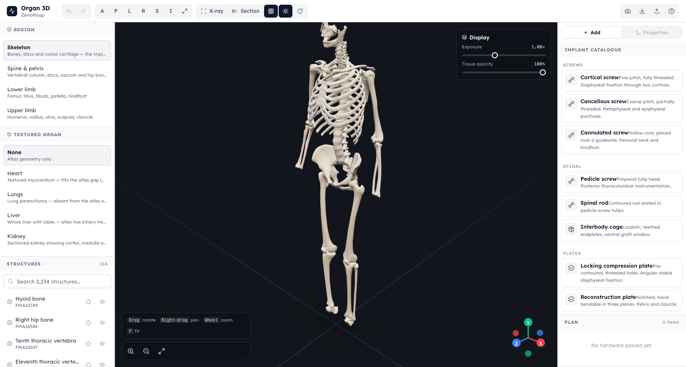

# Organ 3D — ZenoHosp

A production-grade 3D anatomy and implant-planning viewer. A clinician loads a
region of the body, navigates it freely, and places sized hardware — screws,
plates, nails, cages, grafts — against real anatomy.

Built to drop into the existing HMS front end: same **Lexend** typography, same
`--hms-*` design tokens, same button and card primitives.



---

## Running it

```bash
npm install
./scripts/fetch-models.sh    # anatomy data — NOT in git, see below
npm run dev                  # http://localhost:5180
npm run build                # -> dist/
npm run preview
```

Requires Node 20+. Entirely client-side: no API, no database, no auth, no
runtime network calls beyond fetching its own static model files. Even the
lighting environment is generated in-process rather than pulled from a CDN, so
it works on a hospital network with no outbound internet.

**The anatomy data is in git** (`public/models/`, ~58 MB, CC BY-SA). The four
**textured organ meshes are not** — they have no verified licence, so
`public/models/organs/` is gitignored. Add them locally with
`./scripts/fetch-models.sh --all`; everything works without them.

---

## Navigation

| Action | Input |
| --- | --- |
| Rotate | Left drag / one-finger |
| **Move** (pan) | **Right drag**, middle drag, or two-finger |
| **Zoom in / out** | **Wheel**, pinch, `+` / `−`, or the on-canvas buttons |
| Fit to view | `F` or the frame button |
| Standard views | `A P L R S I` in the toolbar (anterior, posterior, left, right, superior, inferior) |

Zoom follows the cursor, so pointing at a vertebra and scrolling dives toward
that vertebra rather than the screen centre.

| Implant action | Key |
| --- | --- |
| Move / Rotate / Scale gizmo | `W` `E` `R` |
| Undo / Redo | `Ctrl+Z` / `Ctrl+Shift+Z` |
| Duplicate | `Ctrl+D` |
| Delete | `Delete` |
| X-ray | `X` |
| **Consult mode** (full screen, plain English) | `C` |
| **Before / after** | `B` |
| Clear selection / exit consult mode | `Esc` |

---

## What it does

**14 anatomical regions** from a 2,234-structure atlas — skeleton, spine &
pelvis, lower limb, upper limb, thorax, heart, airway, abdominal viscera,
urinary tract, arterial tree, venous tree, nervous system, musculature, whole
body. Every structure is individually selectable, hideable and isolatable, and
searchable by name with its FMA concept id.

**15 parametric implants** across screws, plates, nails & rods, spinal,
arthroplasty, bone graft and cranio-maxillofacial. Hardware is *generated* from
surgeon-facing parameters — length, thread diameter, pitch, hole count,
lordosis — each constrained to its real clinical range, so a 45 × 6.5 mm
pedicle screw is built as that screw rather than scaled from a stock mesh.
Screws carry genuine helical threads.

**9 materials** with physically-matched roughness: titanium (blasted and
polished), 316L stainless, cobalt-chrome, PEEK, zirconia, HA-coated, and
cortical / cancellous bone graft.

**Clinical display modes** — x-ray ghosting to keep seated hardware visible
inside bone, a movable cross-section plane on any axis, exposure and tissue
opacity, contact shadows, turntable.

**Plans** export and import as JSON, and the current view captures to PNG.

---

## Explaining it to the patient

The planning surface above is written for a surgeon. Turning the screen toward
a patient is a different job, so there is a second mode for it — the **Explain**
tab and `C` for consult mode.

**Mark the injury.** Select a bone and add a fracture: transverse, oblique,
spiral or comminuted, positioned along the shaft, with adjustable shift,
angulation and rotation. The bone is genuinely split into fragments and
displaced — the tool can show the problem, not just the fix.

**Before / after.** One switch flips between *the injury* (fragments displaced,
hardware hidden) and *the repair* (fragments reduced, hardware in place), and
the fragments animate back into position between the two. `B` toggles it
mid-sentence. That animation is the part patients understand fastest.

**Consult mode** (`C`) collapses both panels, hides the gizmos, drops the
technical overlays and gives the model the full screen. It also switches on
plain-English labels: `FMA24475 · Left femur` becomes **Left thigh bone (left
femur)**. The medical term is kept in parentheses on purpose — the patient will
hear it again from everyone else in the hospital.

**Patient handout.** Captures the injury and the repair from the live view and
builds a printable A4 page: what happened, what we plan to do, each implant
described by what it *does* ("a metal rod placed down the hollow centre of the
bone, sharing the load while it heals"), and a list of questions worth asking.
Prints or saves as PDF. Most of a consultation is forgotten within the hour;
this is the cheapest available fix.

**[`docs/USER-GUIDE.md`](docs/USER-GUIDE.md)** — full step-by-step operating
instructions, every control, keyboard reference, troubleshooting and limits.

**[`docs/HMS-INTEGRATION.md`](docs/HMS-INTEGRATION.md)** — mounting this as a
tab in the HMS consultation page.

---

## Architecture

```
src/
├── three/
│   ├── atlasLoader.js       BodyParts3D binary decode -> one merged geometry
│   ├── partMaterial.js      per-part colour/visibility via data-texture lookup
│   ├── materials.js         tissue + hardware PBR presets
│   ├── implantGeometry.js   parametric hardware builders (helical threads etc.)
│   ├── AnatomyMesh.jsx      the single-draw-call anatomy mesh
│   ├── OrganModel.jsx       textured GLB organs, anatomically anchored
│   ├── ImplantMesh.jsx      implant + transform gizmo
│   ├── fracture.js          bone splitting + fragment displacement
│   ├── FractureLayer.jsx    fragments + the reduction animation
│   ├── Stage.jsx            self-contained studio lighting rig
│   └── Viewer.jsx           canvas, camera, controls, clipping
├── components/              Toolbar, AnatomyRail, ImplantPanel, HelpModal,
│                            ConsultPanel, Handout
├── data/                    anatomy classification, implant catalogue,
│                            plain-language translation
├── store/useSceneStore.js   plan state (undo/redo) + view state
└── styles/                  HMS tokens + app shell
```

Three decisions worth knowing about:

**One draw call for 2,234 structures.** Rendering each structure as its own
mesh would mean 2,234 draw calls a frame. Instead every part is merged into a
single buffer carrying an `aPartIndex` attribute, and per-part colour,
opacity, visibility, hover and selection are looked up from two data textures
inside a patched `MeshPhysicalMaterial`. Toggling a structure writes one texel
rather than rebuilding geometry.

**Zero-copy geometry.** `atlas.json` stores byte offsets into the `body-*.bin`
chunks, so building a part's geometry is a few typed-array views rather than a
parse — which is what makes two million triangles viable from a cold start.
Chunks are fetched lazily, per region.

**Scene units are centimetres.** BodyParts3D ships metres; hardware is
specified in millimetres. The conversion happens once, in the loader
(`ATLAS_SCALE`). Getting this wrong renders a 400 mm nail as a slab across the
viewport — it was a real bug during development, and the constant exists so it
stays fixed.

---

## Data sources and licensing

Full detail in [`public/models/ATTRIBUTION.md`](public/models/ATTRIBUTION.md),
and reachable in-app from the **?** button.

- **Anatomy (2,234 structures)** — BodyParts3D, Database Center for Life
  Science (DBCLS), University of Tokyo. **CC BY** (original database CC BY-SA
  2.1 Japan). Attribution is a licence condition and is surfaced in-app.
- **Binary repacking** — [`human-atlas`](https://github.com/ashemag/human-atlas),
  MIT. Only the packed data is vendored; the loader here is our own.
- **Textured organ meshes** — ⚠️ **not distributed with this repository.**
  From [`Human-Organ3D`](https://github.com/yihalem123/Human-Organ3D), which
  claims MIT in its README but ships no licence file, and whose meshes are
  third-party art the owner likely cannot relicense. Fetch them locally with
  `./scripts/fetch-models.sh --all` if you want them. **Establish the upstream
  licence before including them in a deployed product.**

### Licensing

- **This project's source code** — MIT, © ZenoHosp. See [`LICENSE`](LICENSE).
- **The anatomy data** is *not* MIT. It stays under CC BY-SA and carries its
  own conditions. ShareAlike binds the data, not software that reads it, so the
  code licence is unaffected — the reasoning is set out in
  [`THIRD-PARTY-NOTICES.md`](THIRD-PARTY-NOTICES.md).
- All npm dependencies are permissive (MIT / ISC); none impose copyleft.

## Intended use

A visualisation and communication tool built on a **generic adult male
reference anatomy**. It is not patient-specific, not derived from any
patient's imaging, and **not a diagnostic or surgical-navigation device**.
Exported plans are illustrative.
